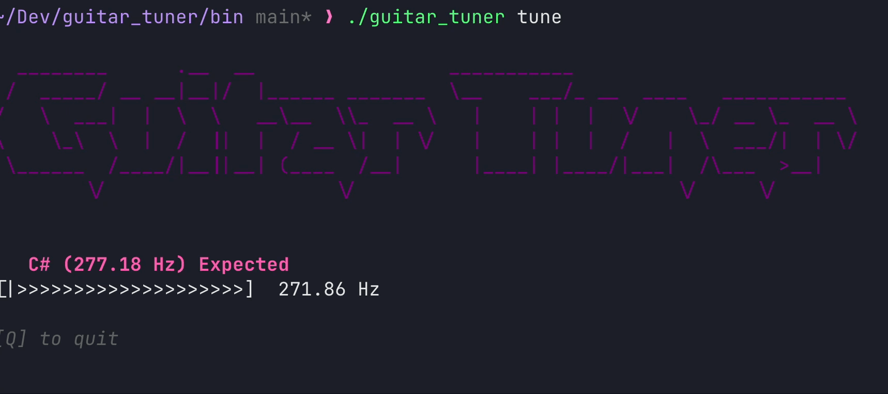

# 🎸 Guitar Tuner CLI

## Just a simple guitar tuner for your terminal  


---

## 📦 About

**Guitar Tuner CLI** is a command-line application written in Go that turns your terminal into a real-time interactive guitar tuner.  
It uses powerful libraries such as [PortAudio](http://www.portaudio.com/), [BubbleTea](https://github.com/charmbracelet/bubbletea), [Lipgloss](https://github.com/charmbracelet/lipgloss), and [Cobra](https://github.com/spf13/cobra) to provide a stylish and accurate note detection experience straight from your system’s microphone.

---

## 🚀 How to Run

### Run directly with `go run`:

```bash
go run main.go tune
```

### Build and run the binary:

```bash
go build -o ./bin/guitar_tuner main.go
cd bin
./guitar_tuner tune
```

> The `tune` command starts microphone input reading and displays a visual interface with real-time note feedback.

---

## How the Code Works

### CLI Commands

The application uses **Cobra CLI** to structure its commands:

- `tune`: starts the note detection process.
- `[q]` or `[Ctrl+C]`: interactive shortcut to stop tuning and exit the program.

---

### Audio Input

It uses **PortAudio** to capture real-time audio from your microphone:

- Raw audio is captured as a 16-bit integer buffer.
- The default sample rate is 44100 Hz.

---

### Audio Processing (FFR)

The audio processing pipeline includes:

1. **Normalizing the audio buffer**
2. Applying a **Hanning window**
3. Performing **Fast Fourier Transform (FFT)**
4. Extracting the **dominant fundamental frequency**

---

### Note Comparison

Once the dominant frequency is determined:

- A peak-finding algorithm with **O(N log N)** complexity extracts relevant frequency data.
- A note is matched using a **O(log N)** optimized lookup table.

---

### Real-Time CLI Display

The interface is built using the awesome Charm ecosystem:

- **[Bubble Tea](https://github.com/charmbracelet/bubbletea)**: manages interactive state and input.
- **[Lipgloss](https://github.com/charmbracelet/lipgloss)**: adds visual style to the CLI.

#### UI Includes:

- Current note name
- Detected vs expected frequency
- A dynamic tuning bar that shows how close you are to perfect tuning

---

##  Example Output

```text
   E (82.41 Hz)
[<<<<<<|>>>>>>] 81.90 Hz

[Q] to quit
```

---

## Requirements

- Go 1.18+
- PortAudio installed on your system
  - macOS: `brew install portaudio`
  - Ubuntu/Debian: `sudo apt install portaudio19-dev`

---
